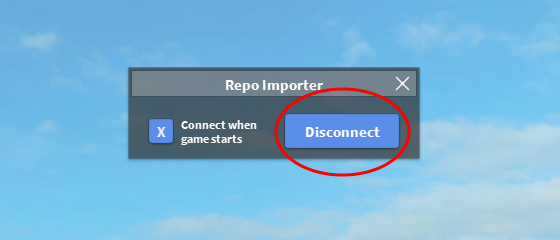
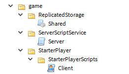

# Repo Import

This is a [ROBLOX](https://roblox.com) plugin that aids in letting you code your game outside of ROBLOX Studio.

Managing code with Git is very important, but currently not possible in ROBLOX. That's where this plugin and [Elixir](https://github.com/voxeldavid/elixir) come in.

Elixir compiles Lua source code into a ROBLOX Model file that you can import into your game. This lets you write all the code for your game outside of ROBLOX Studio, and then drag-and-drop the model in when you're ready.

With this approach you run into the workflow of: code -> compile -> drag into studio -> put everything in the right place. This plugin takes care of that last step for you.

## Getting Started

First thing you'll want to do is make sure the plugin is listening for repositories. It should look like this:



To make your project work with the plugin, you need to structure your code to mimic ROBLOX's DataModel. Here's an example of how you could do that:

```
src/
  game/
    ReplicatedStorage/
      Shared.lua
    ServerScriptService/
      Server.lua
    StarterPlayer/
      StarterPlayerScripts/
        Client.lua
```

When you compile this with Elixir and import into your game, it will look like this:



This is where the plugin takes over, when it's connected it will be listening for newly imported repositories. Anything named `game` added to the Workspace is treated as a repository and is overlayed over your existing services.

This means anything under the _folder_ for ReplicatedStorage is moved to the in-game ReplicatedStorage. The same goes for everything else under the `game` folder.
